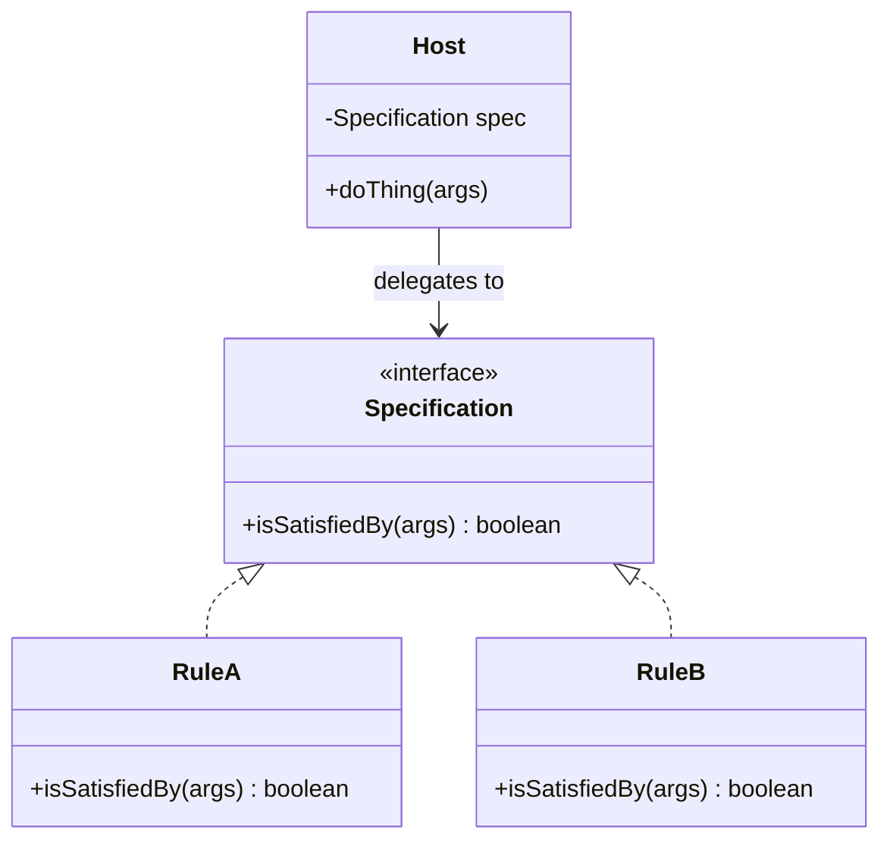

## Specification — a yes/no question, named

You have a host object that needs to make a decision: *"can these two
things be linked?"*, *"is this order eligible for free shipping?"*,
*"does this user have access to that file?"*. The naive shape is an
`if`-pyramid inside the host. The Specification pattern says: **lift
that decision into a tiny interface and let the host delegate to it.**

```java
@FunctionalInterface
public interface LinkPolicy {
    boolean canLink(Vertex<?> a, Vertex<?> b);
}
```

That's it. One method. Returns a boolean. No side effects, no state. A
*specification* is a predicate object — a yes/no question with a name.

### The Nexus example

In Phase 2.5 you build a `Graph`. The Graph needs to know whether two
vertices are *allowed* to be linked. The temptation is to put the rule
inside `Graph.connect`:

```java
// ❌ The rule is welded into the host.
public boolean connect(Vertex<?> a, Vertex<?> b) {
    if (!a.getPayload().getType().equals(b.getPayload().getType())) {
        return false;
    }
    // …
}
```

This works once. It rots immediately. The next requirement —
*"Cisco devices can only link if they're in the same subnet"* — turns
the `if` into a tree. The change after that wraps the tree in another
condition. Every new rule edits Graph.

The Specification version puts the rule *outside* Graph:

```java
// ✅ Graph asks; policy answers.
public boolean connect(Vertex<?> a, Vertex<?> b) {
    if (!policy.canLink(a, b)) return false;
    // …
}
```

Now you can write `SameTypeOnly`, `SameSubnetOnly`, `WithinSameDC` as
separate small classes (or lambdas), without touching Graph. That's the
**Open/Closed Principle** in action: open for extension, closed for
modification.

### The shape



The host knows about the interface. It does *not* know about RuleA or
RuleB. That direction of dependency is the design.

### Composition — the bonus that pays for the pattern

A specification is a function. Functions compose:

```java
public interface LinkPolicy {
    boolean canLink(Vertex<?> a, Vertex<?> b);

    default LinkPolicy and(LinkPolicy other) {
        return (a, b) -> this.canLink(a, b) && other.canLink(a, b);
    }
    default LinkPolicy or(LinkPolicy other) {
        return (a, b) -> this.canLink(a, b) || other.canLink(a, b);
    }
    default LinkPolicy negate() {
        return (a, b) -> !this.canLink(a, b);
    }
}
```

You wrote three lines of code and got a small **algebra of rules** for
free. `SAME_TYPE_ONLY.and(SAME_SUBNET_ONLY)` is a new policy without a
new class. Any system with a "rule engine" — firewalls, ACLs, query
filters, validation pipelines — is reinventing this poorly.

### Testing — the strongest argument

A specification has *no dependencies* on its host. So tests are tiny:

```java
@Test
void same_type_links_two_cisco_devices() {
    var a = new Vertex<>(new CiscoDevice("c1", "h1", "10.0.0.1", "x"));
    var b = new Vertex<>(new CiscoDevice("c2", "h2", "10.0.0.2", "x"));
    assertTrue(LinkPolicy.SAME_TYPE_ONLY.canLink(a, b));
}

@Test
void same_type_rejects_cisco_and_servicenow() {
    var a = new Vertex<>(new CiscoDevice(...));
    var b = new Vertex<>(new ServiceNowRecord(...));
    assertFalse(LinkPolicy.SAME_TYPE_ONLY.canLink(a, b));
}
```

No Graph. No edges. No setup. Two lines of arrange, one line of assert.
That's the test class for *every* policy you'll ever write. Compare
that to testing the same logic when it's tangled inside `Graph.connect`,
where you have to construct a graph, add vertices, attempt links, and
inspect rejection reasons. The pattern doesn't just clean up the
production code — it cleans up the tests by an order of magnitude.

### When to reach for it

You're holding a Specification opportunity if:

- A method has a boolean check that could be replaced by *"ask someone
  else."*
- The check is likely to grow (more rules, conditional rules, mode
  flags).
- The same check appears in two places (DRY out, but only via the
  interface — not by sharing a static helper).
- You want to test the rule independently of where it's used.

### When *not* to reach for it

Specifications add an indirection. Don't apply them to:

- One-shot, never-going-to-grow checks (`if (list.isEmpty()) …`).
- Checks that touch many fields and need access to the whole host's
  internals — at that point, it's a *method*, not a specification.
- Performance-critical inner loops where the lambda overhead matters
  (rare; profile first).

### Family resemblance — Strategy vs Specification

Both are "behaviour as an object." The split is what the behaviour
returns:

| Pattern | Method returns | Typical use |
| --- | --- | --- |
| **Specification** | `boolean` | "Is this allowed / matching / valid?" |
| **Strategy** | a result | "How should I compute / format / sort this?" |

A LinkPolicy is a Specification. A `CompressionStrategy` is a Strategy.
Both follow the same composition trick.

### The mental shift

The rule in your head should be: *"a host should not contain a question
it can ask someone else."* Specifications are how you make that
*"someone else"* concrete. Once you see the pattern, you'll spot the
opportunity in firewall rules, query builders, validation frameworks,
authorisation checks, search filters, feature flags — anywhere
software answers a yes/no question on behalf of a caller.

Phase 2.5 of Nexus is your first real exposure. Build it carefully —
the same shape recurs in every serious system you'll ever touch.
