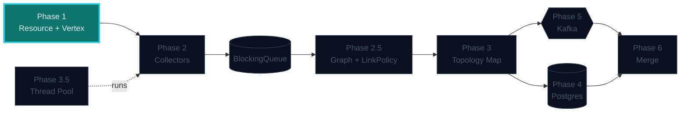
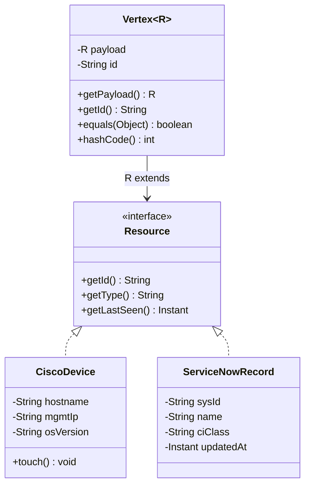

## Phase 1 — The Blueprint

You'll define the *shape* of every resource the system will ever handle,
**without knowing what concrete resources are**. That's the whole point:
future-you (or a teammate) adds `SnmpDevice` six months from now and the
rest of the system shouldn't change.

### Where this fits in the bigger picture



> Brightly lit = **what this phase builds**. Dimmed = already in place from earlier phases. Outlined = coming up. The same map appears on every phase so you can always see where you are.

---

### Before you code: the Contract Document

> 🧠 **The most important habit on this platform.**
>
> Before you write a single line of `Vertex.java`, write a short prose
> contract for it. Bullets only. Each bullet is one decision you're freezing.
>
> Read [How to use this platform](/how-to-use) if you haven't yet, and the
> [Testing — Contracts, Not Code](/concepts/testing) concept page.

A worked example, for the `Vertex<R>` you're about to build:

```markdown
# Vertex Contract

## Invariants
- A vertex always has a non-null payload.
- A vertex's id is *derived* from its payload (id + type), not supplied by
  the caller. Same payload in → same vertex id out.
- A vertex is immutable: payload cannot be replaced after construction.

## Equality
- Two vertices are equal iff their ids are equal. Other payload fields
  don't participate in equality.

## Generics
- `Vertex<R extends Resource>`. The compiler — not a runtime check —
  enforces that the payload is a Resource subtype.

## Explicitly NOT in scope (yet)
- Linking to other vertices.
- Tracking neighbours.
- Anything graph-shaped — that's Phase 2.5's job.
```

Each bullet maps directly to a test method. The test class **is** this
document, executable. We'll do that in the tasks below.

---

### 🧩 Pattern in play — Bounded Generics

`Vertex<R extends Resource>` reads as: *"a Vertex parameterised by some
type R, where R must be Resource or a subtype."*

- ✅ `Vertex<CiscoDevice>` — CiscoDevice implements Resource
- ✅ `Vertex<ServiceNowRecord>` — also implements Resource
- ❌ `Vertex<String>` — String is not a Resource (compile error)

Two things at once: **compile-time safety** (no non-resource sneaks in) and
**method access** — you can call `payload.getId()` inside Vertex because
the compiler knows every R is at least a Resource.

The negative case (`Vertex<String>`) is enforced **by the compiler**, not
by a test. That's an important distinction — see the
[Testing concept](/concepts/testing) for why.

See also: [Generics & Wildcards](/concepts/generics-wildcards).

---

### What you'll build

```
model/
├─ Resource.java          interface — the contract
├─ Vertex<R>.java         generic, immutable container, R extends Resource
├─ CiscoDevice.java       concrete (network device)
├─ ServiceNowRecord.java  concrete (CMDB record)
└─ Seed.java              demonstrates the abstraction holds
```

### How the pieces relate



Notice what's **not** here: no `link()`, no `getNeighbours()`, no edge
list. A vertex is a *value wrapper* around a resource. Anything to do with
relationships between vertices belongs to a graph — that's Phase 2.5.

> **Foreshadow.** When you reach Phase 2 (collectors), you'll have multiple
> vertices flowing into a queue. The natural next question is *"where do I
> store the connection between two of them?"* The answer — surprise — is
> **not on the vertex**. Phase 2.5 introduces `Graph` + `LinkPolicy` to
> handle linking properly. Keeping `Vertex` dumb now pays off then.

---

### Tasks in this phase

1. Define the `Resource` interface
2. Build the generic `Vertex<R>` container — immutable, equals-by-id
3. Implement `CiscoDevice`
4. Implement `ServiceNowRecord`
5. Seed a small collection of vertices and prove the abstraction holds

