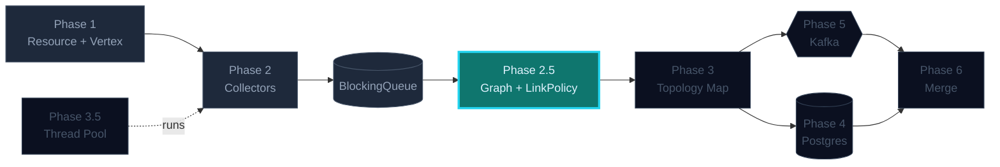
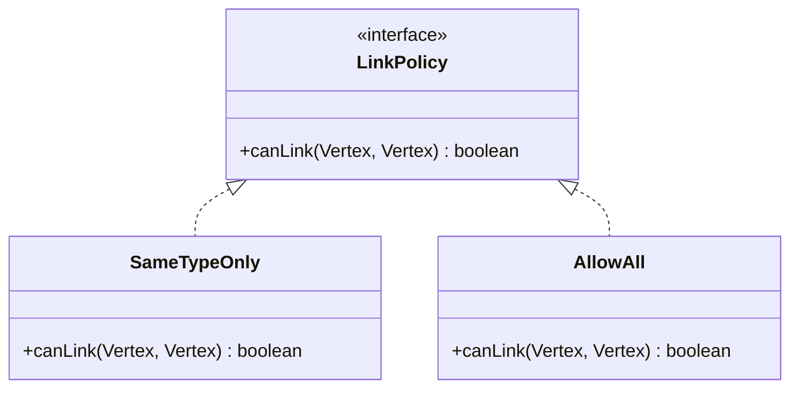
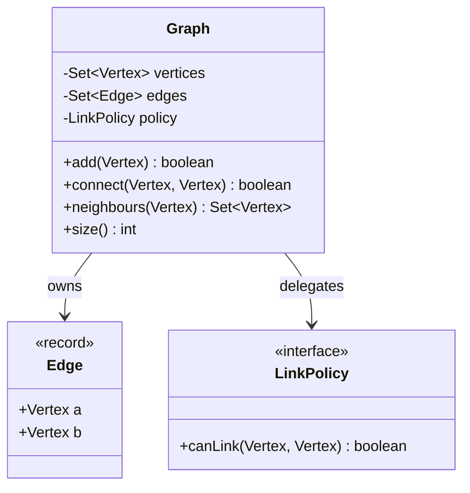

## Phase 2.5 — Graph & LinkPolicy

In Phase 1 you built a deliberately *dumb* `Vertex<R>`. In Phase 2 you
built collectors that emit those vertices into a queue. Now you have a
pile of vertices on a conveyor belt and an obvious next question:

> *"How do I represent that **this** Cisco device is connected to **that**
> ServiceNow application?"*

The answer is **not** to bolt a `link()` method onto Vertex. The answer
is a **Graph** layer that owns the relationships, with a **LinkPolicy**
that decides whether two vertices are *allowed* to be connected.

This phase is small in code, big in idea. It's where the platform stops
teaching Java and starts teaching design.

### Where this fits in the bigger picture



> Brightly lit = **what this phase builds**. Dimmed = already in place. Outlined = coming up.

---

### Before you code: the Contract Document

This time you write contracts for **two** things — Graph and LinkPolicy —
because they're related and you want to freeze the boundary between them.

```markdown
# Graph Contract

## Invariants
- A graph stores a set of vertices and a set of undirected edges.
- The same vertex (by id) cannot be added twice — duplicates collapse.
- A vertex cannot be linked to itself (no self-loops).
- The same edge cannot exist twice (no multi-edges).

## connect(a, b)
- Both vertices must already be in the graph; otherwise throw
  `IllegalArgumentException`.
- The link is rejected — silently, return `false` — if the configured
  `LinkPolicy` says no.
- Edges are undirected: `connect(a, b)` and `connect(b, a)` are the same.
- Returns `true` if a new edge was added, `false` otherwise.

## neighbours(v)
- Returns an **unmodifiable** Set. Mutating it must throw.
- Order is not specified.

## Explicitly NOT in scope
- Persistence (Phase 4).
- Thread safety (Phase 3 covers concurrency).
- Edge weights, directions, or metadata — keep edges plain for now.

# LinkPolicy Contract

## Shape
- `boolean canLink(Vertex<?> a, Vertex<?> b)`. Pure function — no state,
  no side effects.
- Default policy: `SAME_TYPE_ONLY` — return `true` iff both payloads have
  the same `getType()`. (e.g. Cisco↔Cisco yes, Cisco↔ServiceNow no.)

## Substitutability
- Any LinkPolicy can be swapped in without changing Graph.
- Tests for Graph use a permissive `ALLOW_ALL` policy so Graph's own
  invariants are tested in isolation from policy logic.
```

Two contracts, two test files: `GraphContractTest.java` and
`LinkPolicyContractTest.java`. The bullets become tests, exactly like
Phase 1.

---

### 🧩 Pattern in play — Specification

`LinkPolicy` is the **Specification pattern** in its smallest form: a
predicate object that answers a single yes/no question about a domain
value. Because it's an interface (not a flag, not a switch statement),
you can:

- Compose policies (`and`, `or`, `not`) without touching Graph.
- Add new policies (`SAME_SUBNET_ONLY`, `WITHIN_SAME_DC`) later without
  modifying any existing code — the Open/Closed Principle in action.
- Test policies in pure isolation — no Graph, no vertices that link
  themselves, just `canLink(a, b)` returning a boolean.



**Why this matters beyond Java.** The same shape — *"a small interface
the host object delegates a yes/no decision to"* — appears in firewall
rules, authorisation checks, query filters, validation layers. Once you
see it, you'll see it everywhere.

See also: [Specification Pattern](/concepts/specification-pattern) (concept page).

---

### What you'll build

```
graph/
├─ Edge.java              record — pair of vertices, undirected equality
├─ LinkPolicy.java        interface — boolean canLink(a, b)
├─ SameTypeOnly.java      default policy
├─ AllowAll.java          test-only policy
└─ Graph.java             the host — vertices, edges, neighbours()
```

### How the pieces relate



Notice `Vertex` doesn't appear as a *participant* in the linking — only
as a *value* the Graph stores. That's the design moment of this phase.

---

### Tasks in this phase

1. Build `Edge` as an immutable record with undirected equality
2. Define `LinkPolicy` interface + `SameTypeOnly` default + `AllowAll` for tests
3. Build `Graph` with `add`, `connect`, `neighbours`, `size`
4. Wire collectors from Phase 2 into a graph using `SameTypeOnly`
