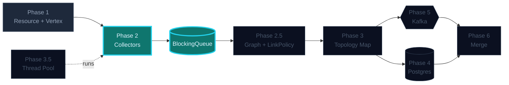
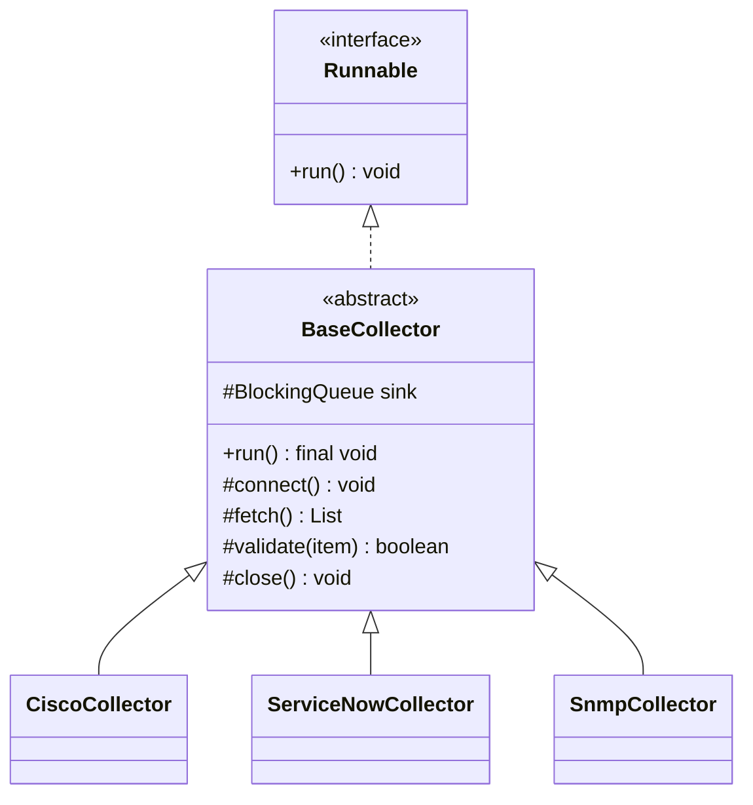
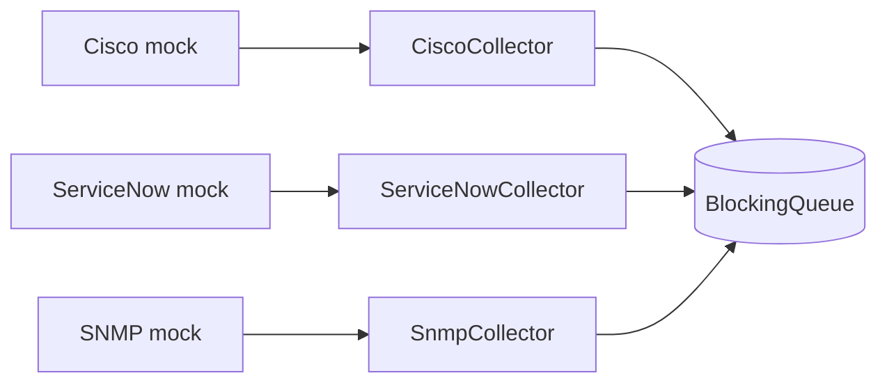

## Phase 2 — Inheritance & Interfaces

You have multiple data sources. They all do the same dance with one different
step: connect, fetch, validate, enqueue, close. **Connect** and **fetch**
differ per source; everything else is identical. Textbook setup for the
**Template Method** pattern.

The base class owns the lifecycle and is `final` on `run()`. Subclasses
override only what's truly source-specific.

### Where this fits in the bigger picture



> Brightly lit = **what this phase builds**. Dimmed = already in place. Outlined = coming up.

### What you'll build

```
collector/
├─ BaseCollector.java           abstract — owns the run() template
├─ CiscoCollector.java          fetches from a (mock) Cisco SSH endpoint
├─ ServiceNowCollector.java     fetches from a (mock) ServiceNow REST API
└─ SnmpCollector.java           proves a third source needs no template change
```

### Class hierarchy



### What flows where



### Tasks in this phase

1. Implement the abstract `BaseCollector` template
2. Build a concrete `CiscoCollector`
3. Build a concrete `ServiceNowCollector`
