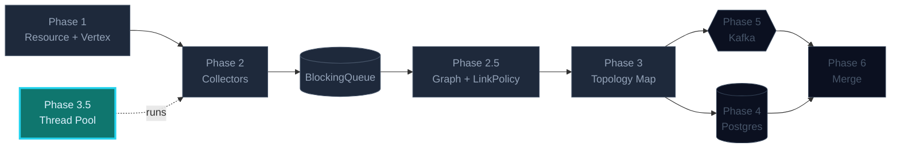
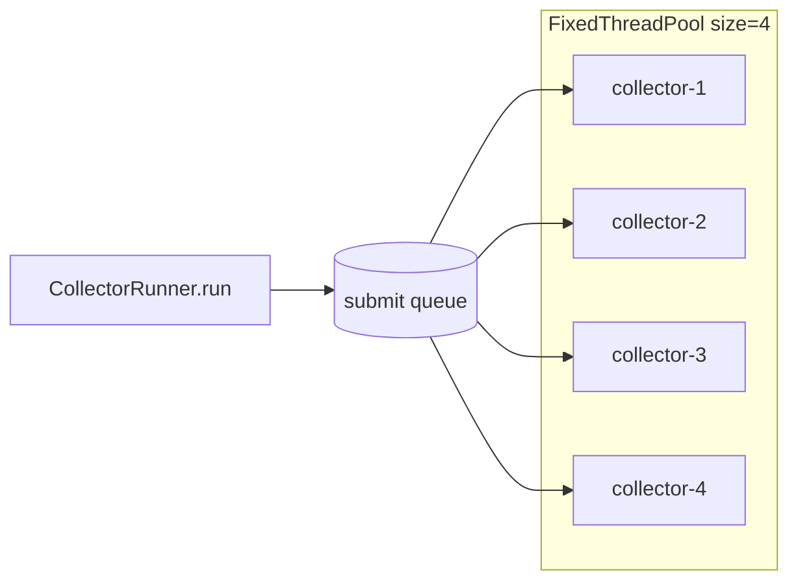
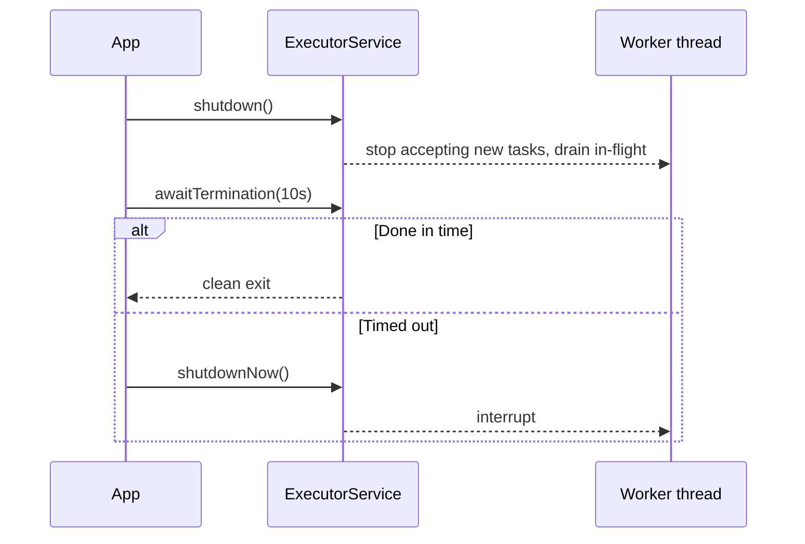

## Phase 3.5 — ExecutorService

You probably wrote `new Thread(collector).start()` in Phase 3. Time to grow up.
Replace manual threads with a named, sized, properly-shutdown
`ExecutorService`. Bonus: scheduled re-runs every N seconds.

### Where this fits in the bigger picture



> Brightly lit = **what this phase builds**. Dimmed = already in place. Outlined = coming up.

### What you'll build

```
runtime/
├─ CollectorRunner.java    owns a fixed pool, names threads, handles errors
├─ ScheduledRunner.java    reruns each collector every N seconds
└─ ShutdownHook.java       cooperative shutdown — drain or timeout
```

### Pool layout



### Shutdown sequence



### Tasks in this phase

1. Run all collectors on a fixed pool with named threads + an uncaught-exception handler
2. Schedule each collector to repeat every 30 seconds with backoff on failure
