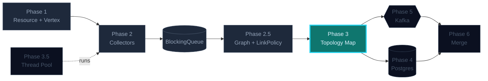
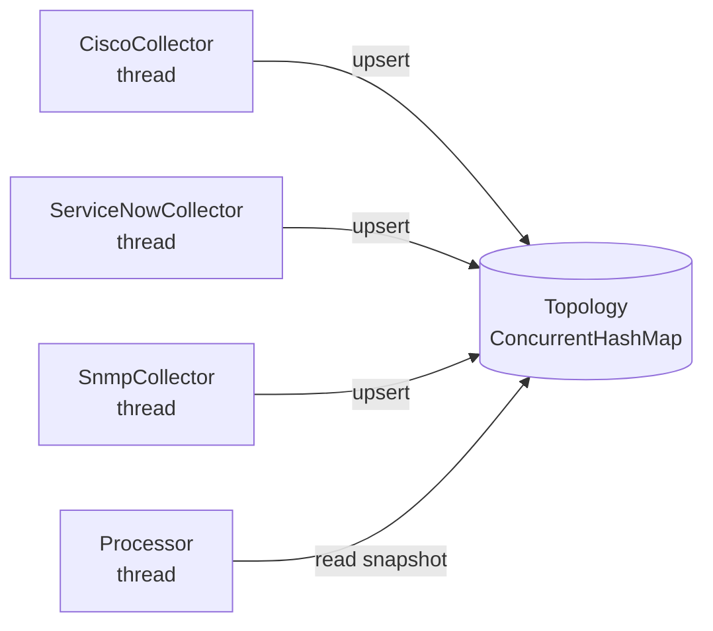
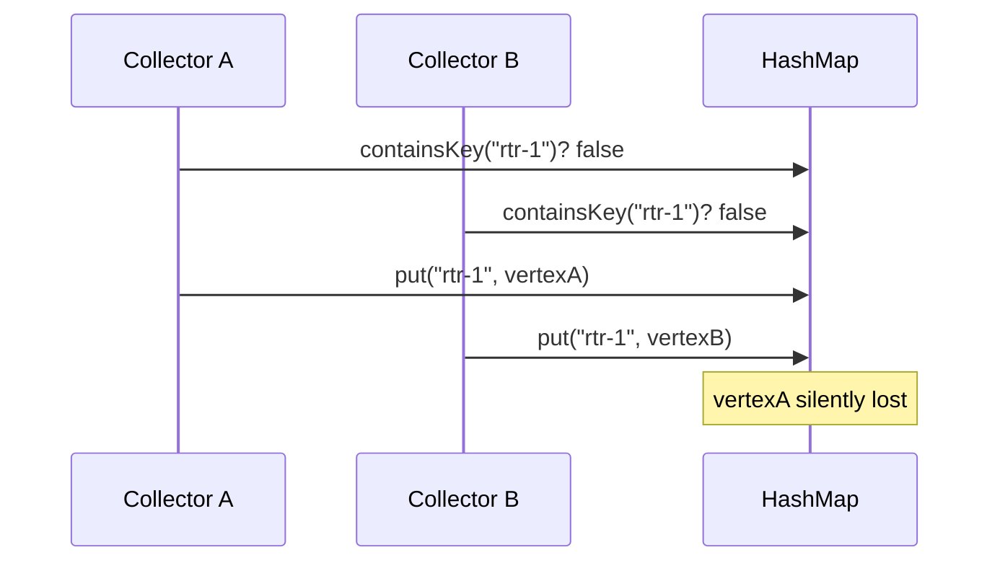

## Phase 3 — Concurrency & Collections

Multiple collectors writing to one topology map. The naive `HashMap` corrupts
under contention; `Collections.synchronizedMap` is correct but serializes
every reader. `ConcurrentHashMap` + the right *atomic* methods
(`computeIfAbsent`, `merge`, `compute`) is the answer.

### Where this fits in the bigger picture



> Brightly lit = **what this phase builds**. Dimmed = already in place. Outlined = coming up.

### What you'll build

```
manage/
├─ Topology.java       thread-safe container around ConcurrentHashMap
├─ Linker.java         thread-safe edge writes (no torn reads)
└─ Stats.java          snapshot counts without copying the world
```

### The contention picture



### The trap you're avoiding



`computeIfAbsent` collapses the check-then-act into one atomic call.
That's the whole game.

### Tasks in this phase

1. Build the race-free `Topology` map
2. Add safe edge linking — no lost writes when two threads link in parallel
3. Provide a `stats()` snapshot that doesn't block writers
