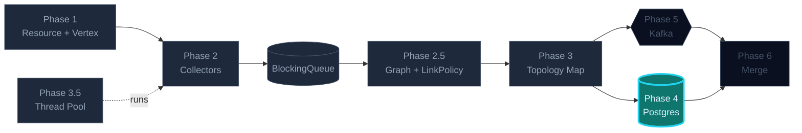
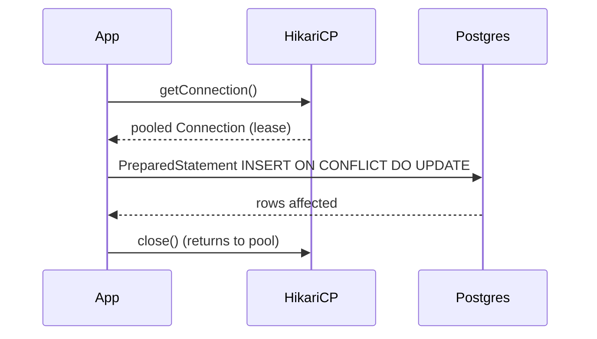

## Phase 4 — JDBC & Persistence

Snapshot the in-memory topology to Postgres so a restart doesn't wipe state.
Connection pooling (HikariCP), prepared statements, transactional batch
upsert. Skipped the ORM on purpose — you should *see* the SQL.

### Where this fits in the bigger picture



> Brightly lit = **what this phase builds**. Dimmed = already in place. Outlined = coming up.

### What you'll build

```
db/
├─ DataSourceFactory.java   pooled HikariCP, sized for the DB
├─ ResourceDao.java         race-free UPSERT (INSERT ... ON CONFLICT)
├─ EdgeDao.java             graph edges in a join table
└─ StaleSweeper.java        marks resources STALE past TTL
```

### The flow per upsert



### Pool sizing rule of thumb

If `replicas x maximumPoolSize` approaches the DB's `max_connections`, the
*next* replica can't connect at all. Leave headroom for psql sessions,
migrations, monitoring. A common safe target is 80% of `max_connections`.

### The shape of the schema (already created for you)

```sql
CREATE TABLE resources (
  id         VARCHAR(255) PRIMARY KEY,
  type       VARCHAR(50)  NOT NULL,
  name       VARCHAR(255) NOT NULL,
  data       JSONB        NOT NULL,
  last_seen  TIMESTAMP    DEFAULT NOW(),
  status     VARCHAR(20)  DEFAULT 'ACTIVE'
);
```

### Tasks in this phase

1. Configure a HikariCP `DataSource` with sane defaults
2. Implement a race-free `upsert` DAO
3. Add a TTL sweeper that ages out unseen resources
