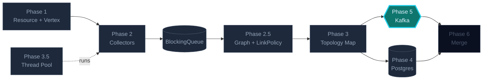
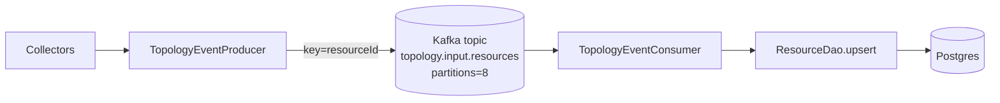
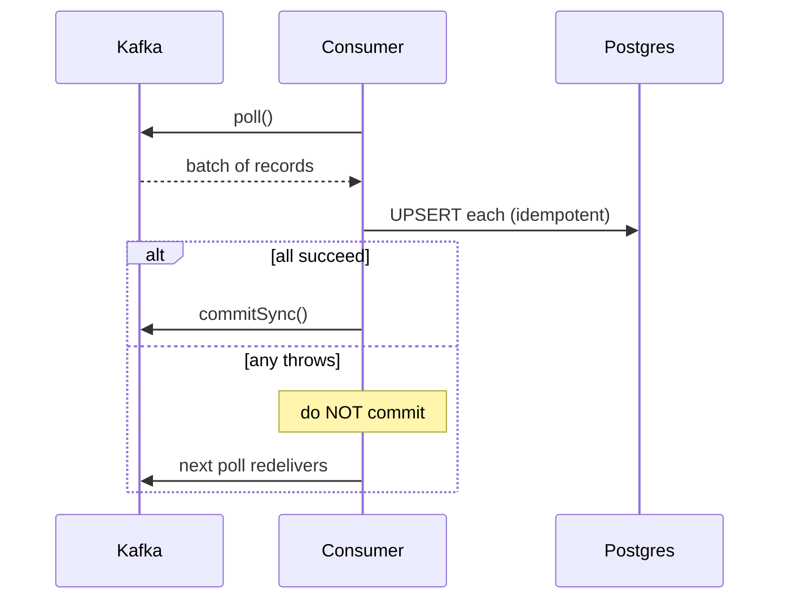

## Phase 5 — Kafka & Event-Driven

Every `upsert` becomes an event. Downstream services consume. You'll meet
partitioning by resource id, exactly-once-ish semantics with idempotent
producers, and the consumer-group rebalancing dance.

### Where this fits in the bigger picture



> Brightly lit = **what this phase builds**. Dimmed = already in place. Outlined = coming up.

### What you'll build

```
events/
├─ TopologyEventProducer.java   keyed publish, idempotence on
├─ TopologyEventConsumer.java   manual commit, at-least-once + idempotent sink
└─ RetryingHandler.java         pause+seek on transient downstream failure
```

### End-to-end flow



### Why key by resource id

Same key produces the same partition, which guarantees strict order per
resource. Without a key it is round-robin and you can re-order updates for
the same router. Two updates for `rtr-1` always land in the same partition
and reach the same consumer in order.

### At-least-once with manual commit



### Tasks in this phase

1. Build an idempotent producer keyed by resource id
2. Build an at-least-once consumer with manual commitSync
3. Handle transient downstream errors with pause + seek instead of crashing
