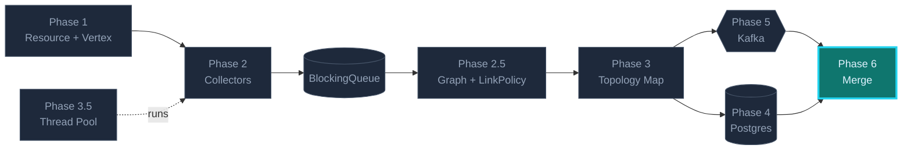
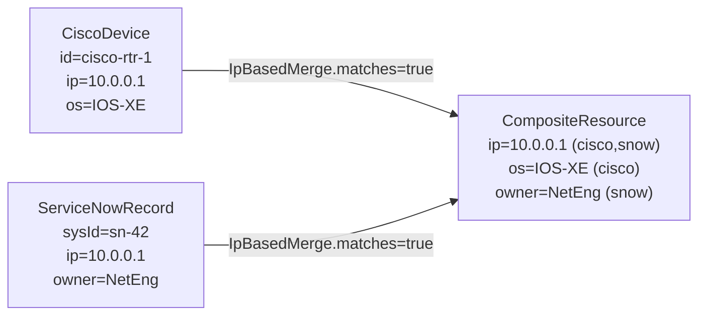
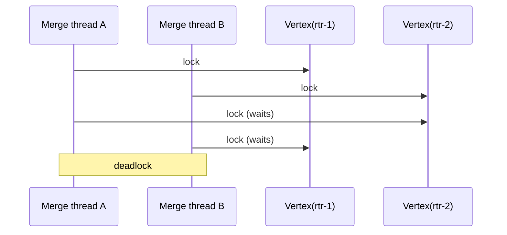

## Phase 6 — Merge & Composite Resources

Cisco says router R-42 has IP 10.0.0.1; ServiceNow says it's owned by team
"NetEng". Both true, both partial. Merge into one composite vertex with
provenance tracking. Watch for deadlocks when merging across two locked
vertices.

### Where this fits in the bigger picture



> Brightly lit = **what this phase builds**. Dimmed = already in place from earlier phases. You finish the picture in this phase.

### What you'll build

```
merge/
├─ MergeStrategy.java       interface — matches() + merge()
├─ IpBasedMerge.java        matches by exact IP
├─ NameBasedMerge.java      matches by hostname (looser)
├─ CompositeResource.java   union with provenance per attribute
└─ MergeEngine.java         global lock-ordering, no deadlocks
```

### What "merge" actually does



### The deadlock you're avoiding



Fix: **always lock the lower id first**. Global ordering means no two
threads ever hold the locks in opposing order.

### Tasks in this phase

1. Define the pluggable MergeStrategy interface + an IpBasedMerge impl
2. Implement deadlock-free pairwise locking in MergeEngine
3. Track per-attribute provenance in CompositeResource
